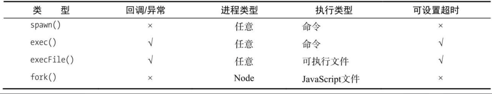

# 玩转进程
## 指引
> JavaScript 代码永远运行在 V8上，是单线程的。

JavaScript将会运行在单个进程的单个线程上。
它带来的好处是：程序状态是单一的，在没有多线程的情况下**没有锁、线程同步**问题，操作系统在调度时也因为较少上下文的切换，可以很好地提高CPU的使用率。
但也带来了问题：

1. 单线程抛出的异常如何捕获？
2. 如何充分利用多核 CPU 服务器？

## 服务模型的变迁
```
同步 -> 复制进程 -> 多线程 -> 事件驱动
```

## 多进程架构
每个进程各自利用一个CPU，以此实现多核CPU的利用。Node 提供了 child_process 模块。
实例见`code`

### 主从模式
通过 `fork` 复制的进程都是一个独立的进程，这个进程中有着独立而全新的 V8 实例。它需要至少 30ms 的启动时间
和至少 10MB 的内存。可见 `fork` 进程是昂贵的。
### 创建子进程


### 进程间通信
在 Master-Worker 模式中，要实现主进程管理和调度工作进程的功能，需要主进程和工作进程之间的通信。


通过`fork()`或其他API创建子进程后，为了实现父子进程之间的通信，父进程与子进程之间将会创建IPC通道
。通过IPC通道父子进程之间才能通过 `message` 和 `send()` 传递消息。

Node 中实现IPC通道的是 管道(pipe)技术。但在node中管道是个抽象层面的称呼，在Windows下由命名管道(name pipe)实现，
*nix 系统则采用Unix Domain Socket 实现。

> ipc 方式？Unix Domain Socket 实现？


> 文件描述符——file descriptor is a unique identifier for a file or other input/output resource, such 
> as a pipe or network socket

父进程在实际创建子进程之前，会创建 IPC 通道并监听它，之后才真正的创建子进程，并通过环境变量告诉子进程 IPC 通道的文件描述符。子进程在启动过程中根据这个文件描述符
去连接已存在的 IPC 通道，从而完成连接。IPC 通道由命名管道或Domain Socket 创建，属于双向通信。
```
父进程 ----- 生成 ------> 子进程
   \					/
     \				  /
    监听/接受	        连接
 	    \		   /
 	      \      /
 	        IPC
```

### 句柄传递
如何多进程监听同个端口？
如何通过代理监听多个端口？待解决

让每个进程监听不同的端口，其中主进程监听主端口，主进程接收所有网络请求，再将这些请求分别**代理**到不同端口进程上。

代理方案浪费掉一倍数量的文件描述符的做法影响扩展性（为何浪费？），为解决此问题，进程间支持发送**句柄**。

`sendHandle`参数用于将TCP服务器或套接字对象传给子进程，子进程将接收该对象作为传给在 `message` 事件上注册的回调函数的第二个参数。
在套接字中接收和缓冲的任何数据都不会发送给子进程。那么有以下几个问题：
1. 在父进程关闭 server，会影响已传给子进程的 server 吗？
2. 不影响的话，二者有何区别与联系？多个子进程间的 server 有何联系？
3. 传递 server 给子进程后，父进程的 server 还存在吗？
4. 通过`subprocess.send`方法给子进程时，消息会被序列化，那么`sendHandle`会受影响吗？
5. 具体的 server 对象有哪些？

发送到 IPC 管道中的实际上是发送的句柄文件描述符，是个整数，也会经由`JSON.stringify()`。
```
 父进程 ---消息--> 子进程
                    |
                    --JSON.parse()--> 触发message事件将消息体传递给应用层使用
{
  cmd: "NODE_HANDLE",
  type: "net.Server",
  msg: message
}
```
如果`message.cmd`为`NODE_HANDLE`,将用`type`和`msg`(文件描述符？)还原出对应的对象。

对于`send()`发送的句柄还原出来的服务而言，它们的文件描述符是相同的，所以监听相同端口不会发生异常。

```js
child.send(message, [sendHandle])
```
**句柄** 是一种可以用来标识资源的引用，内部包含了指向对象的文件描述符。

> 书中说，这里子进程和父进程都有可能处理我们客户端发起的请求。


